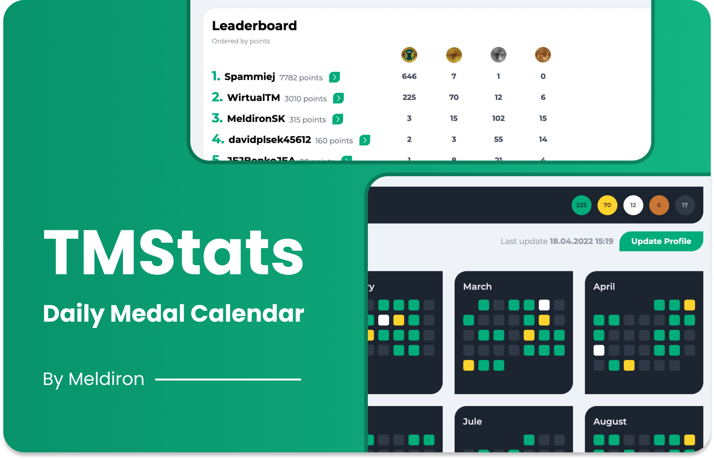

# 🥇 TMStats



## 👋 Introduction

TMStats is a medal calendar that shows overview of all Trackmania medals an user achieved. The website allows user to share campaign or daily maps medals with anyone.

Project focuses on multiple aspects and features:

- [x] Track of the day (TOTD) medals in yearly view
- [ ] Campaign medals in decare view
- [ ] Gamified achievement system

As of right now, project has no business model and is fully free and open-sourced. Project generates expenses, and business model might be added in the future.

## 🤖 Tech Stack

TMStats uses multiple frontend and backend technologies with focus of simplifying the development. Main focus of tech stack in this project is to make development fast and fun, instead of making it scalable and reliable.

- [TailwindCSS](https://tailwindcss.com/), a CSS library to rapidly design components using HTML classes
- [Svelte](https://svelte.dev/), a JS library to build reactive frontend. Alongside this, application uses [TypeScript](https://www.typescriptlang.org/)
- [Svelte Kit](https://kit.svelte.dev/), a Svelte framework to give proejct proper structure, routing and other cool features
- **[Appwrite](https://appwrite.io/)**, a secure backend as a service that provides 90% of necessary backend functionality out of the box

## 💻 Development Setup

**Frontend:**

1. Install dependencies: `npm install`
2. Spin-up HTTP server: `npm run dev`
3. Visit [localhost:3000](http://localhost:3000/)

> If you get `Network Failed` error, it most likely means CORS error, and backend refuses your hostname. To prevent this, either make sure you use `localhost` hostname, or make sure to add your hostname as platform inside Appwrite Project.

**Backend:**

> You only need to spin-up backend if you man on backend changes. For frontend changes, you can skip this step as project is connected to production backend instance.

1. Install [Appwrite](https://appwrite.io/docs/installation) locally, or on development server

> Make soure your `.env` file `_APP_FUNCTIONS_RUNTIMES` variable includes `deno-1.14` runtime. This runtime is used by all functions in this project. Changes to `.env` are applied using command `docker-compose up -d`.

2. Sign up into your Appwrite instance and create project with both name and ID set to `trackmaniaDailyStats`
3. Install [Appwrite CLI](https://appwrite.io/docs/command-line) locally, and login: `appwrite login`

To prepare your changes from your Appwrite instance database to production one:

1. Pull database changes: `appwrite init collection`

To create a new function:

1. Create function: `appwrite init function`

> Make sure you create functions using `deno-1.14` runtime.

Feel free to do manual changes to [appwrite.json](appwrite.json) if you are familiar with this file.

## 🚀 Deployment

**Frontend:**

1. Install dependencies: `npm install`
2. Build project: `npm run build`
3. Deploy folder `build` on a static hosting

> Frontend build does not use any special environment variables.

**Backend:**

1. Deploy database changes, if necessary: `appwrite deploy collection`
2. Deploy function changes, if necessary: `appwrite deploy function`

---

## 📚 Svelte Kit Resources (Generated)

Everything you need to build a Svelte project, powered by [`create-svelte`](https://github.com/sveltejs/kit/tree/master/packages/create-svelte).

## Creating a project

If you're seeing this, you've probably already done this step. Congrats!!!

```bash
# create a new project in the current directory
npm init svelte

# create a new project in my-app
npm init svelte my-app
```

## Developing

Once you've created a project and installed dependencies with `npm install` (or `pnpm install` or `yarn`), start a development server:

```bash
npm run dev

# or start the server and open the app in a new browser tab
npm run dev -- --open
```

## Building

To create a production version of your app:

```bash
npm run build
```

You can preview the production build with `npm run preview`.

> To deploy your app, you may need to install an [adapter](https://kit.svelte.dev/docs/adapters) for your target environment.
